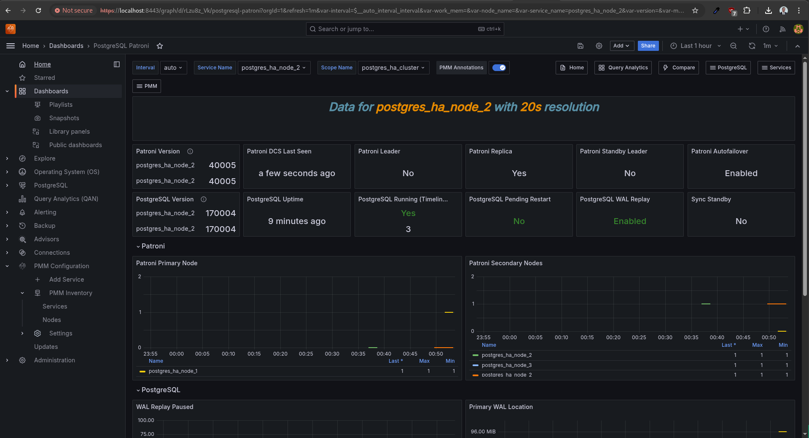
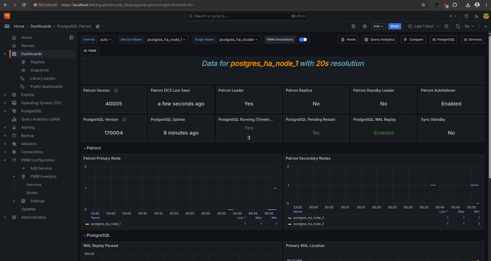
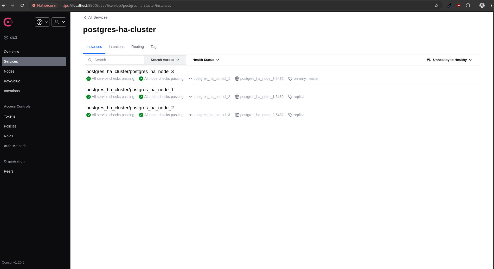

# 🐘 PostgreSQL High Availability (HA) Cluster

## 📝 Overview

This project implements a robust, production-grade PostgreSQL High Availability (HA) cluster using modern infrastructure components including Patroni, Consul, HAProxy, and PMM (Percona Monitoring and Management) to provide resilient, auto-failover database operations with secure service discovery and real-time observability. Patroni manages PostgreSQL leader election across nodes, while Consul ensures dynamic service registration and propagates leader changes. HAProxy uses this service discovery to route write traffic to the current leader and read traffic to replicas, with exposed ports for database operations, Consul UI, and monitoring. PMM agents on each node collect metrics, which are centralized in a PMM server using Prometheus and visualized in Grafana. All inter-service communication is secured using mutual TLS (mTLS), enabling secure, automated, and observable failover handling.

<div align="center">

</div>

### Architecture Components

1. **PostgreSQL Cluster with Patroni**:
   - Multi-node PostgreSQL setup (3+ nodes)
   - Automated leader election and failover
   - Synchronous/Asynchronous replication
   - Automated backup management

2. **Consul Service Mesh**:
   - Distributed service discovery
   - Health checking and monitoring
   - Key-value store for cluster state
   - ACL-based access control

3. **HAProxy Load Balancer**:
   - Dynamic service discovery via Consul
   - Automatic primary/replica routing
   - Connection pooling and load distribution
   - SSL/TLS termination

4. **Security Layer**:
   - End-to-end TLS encryption
   - Mutual TLS authentication
   - Certificate management
   - Secure secret distribution

5. **PMM Monitoring**:
   - Real-time performance monitoring
   - Query analytics and profiling
   - Resource utilization tracking
   - Automated alerting

The entire stack is containerized using Docker and orchestrated through Docker Compose, making it both portable and maintainable. The architecture ensures:
- Zero-downtime failover
- Consistent read/write splitting
- Automated recovery procedures
- Comprehensive monitoring and alerting

## 📋 Prerequisites

### 💻 Supported Operating Systems
This project has been thoroughly tested and verified on the following Enterprise Linux distributions:
- Red Hat Enterprise Linux 9
- Rocky Linux 9
- AlmaLinux 9

### 🔧 System Requirements
- Docker Engine 24.0.0 or later
- Docker Compose V2
- Python 3.12 or later
- make 
- Sufficient system resources:
  - Minimum 4 CPU cores
  - Minimum 8GB RAM
  - At least 50GB available disk space

### 📦 Required Python Packages
All required Python packages are listed in `requirements.txt`. Key dependencies include:
- ansible==11.3.0
- ansible-core==2.18.3
- cryptography==44.0.1
- Other supporting packages

## 🚀 Installation

The project uses a Makefile to automate the setup process. Here are the available make targets:

1. Clone the repository:
   ```bash
   git clone <repository-url>
   cd postgreSQL_ha
   ```

2. Install the environment:
   ```bash
   make install_virtual_env
   ```
   This will:
   - Create a Python virtual environment (postgreSQL_ha.venv)
   - Install all Python dependencies from requirements.txt
   - Install required Ansible collections:
     - community.general
     - community.crypto
     - community.docker

3. Provision the cluster:
   ```bash
   make provision
   ```

   This command triggers an Ansible-based provisioning process that:

   a. **Workspace Setup** (`workspace: postgres_ha_cluster.local/`):
      - Creates the workspace directory structure
      - Sets up sensitive directories for certificates and credentials
      - Prepares volume directories for container persistence

   b. **Docker Compose Environment** (`containers_dir/`):
      - Generates the Docker Compose configuration from templates
      - Creates service-specific environment files
      - Sets up volume mappings for data persistence

   c. **Service Configuration**:
      - PostgreSQL Cluster (${postgres_cluster_replica_count} nodes)
      - Consul Cluster (${consul_cluster_replica_count} nodes)
      - HAProxy Load Balancer
      - Percona PMM (Performance Monitoring)

   The provisioning process uses variables defined in `vars/main.yml` to configure:
   - Cluster sizes and replica counts
   - Directory structures and paths
   - Security credentials and certificates
   - Service states and deployment options

### ⚙️ Additional Make Commands
- `make stop`: Gracefully stop all services without removing data
- `make destroy`: Tear down the entire stack and remove all data

### 🏗️ Component Architecture

#### 1. 🛢️ PostgreSQL Cluster
- Uses Patroni for automated failover and cluster management
- Configuration in `templates/postgres/patroni.yml.j2`
- Features:
  - Automated leader election
  - Streaming replication
  - Automatic failover
  - WAL archiving
  - Connection pooling
  - Metrics exposure for monitoring

#### 2. 🌐 Consul Service Mesh
- Configuration in `templates/consul/`
- Features:
  - Service discovery
  - Health checking
  - Key-value store
  - TLS-secured communication
  - ACL-based access control

#### 3. ⚖️ HAProxy Load Balancer
- Configuration in `templates/haproxy/`
- Features:
  - Dynamic service discovery via Consul
  - Automatic primary/replica routing
  - Health checking
  - Statistics interface

#### 4. 🔒 Security Layer
- Comprehensive TLS implementation:
  - Root CA generation
  - Service-specific certificates
  - Mutual TLS authentication
- Secure secret management
- Component-specific security features in `tasks/security/`

#### 5. 📊 Monitoring Stack (PMM)
- Percona Monitoring and Management (PMM) integration:
  - Advanced PostgreSQL monitoring
  - Query Analytics
  - High-resolution metrics collection
  - Automated problem detection

<div align="center">


*PMM provides comprehensive monitoring of all PostgreSQL nodes*
</div>

- Metrics collection from:
  - PostgreSQL nodes performance
  - Replication lag monitoring
  - Query performance analysis
  - System metrics
  - Consul service health
  - HAProxy load balancing statistics

### 📂 Directory Structure
```
├── files/           # Container and service-specific files
├── tasks/           # Ansible tasks for component setup
│   ├── configuration/  # Component configurations
│   └── security/      # Security-related tasks
├── templates/       # Configuration templates
│   ├── consul/     # Consul configuration
│   ├── haproxy/    # HAProxy configuration
│   └── postgres/   # PostgreSQL and Patroni configuration
└── vars/           # Variable definitions
```

## ⚡ Execution Phase

The provisioning process follows a structured approach:

1. **Security Setup**:
   - Generates root CA certificates using OpenSSL
   - Creates service-specific TLS certificates for:
     - PostgreSQL nodes
     - Consul servers
     - HAProxy endpoints
   - Sets up required secrets and security configurations:
     - Database credentials
     - Consul ACL tokens
     - Service accounts

2. **Configuration Preparation**:
   - Prepares Consul configuration:
     - Server configuration
     - ACL policies
     - Service definitions
   - Configures PostgreSQL nodes:
     - Patroni configuration
     - Replication setup
     - Connection parameters
     - WAL archiving
   - Sets up HAProxy configuration:
     - Backend service discovery
     - Load balancing rules
     - Health checks
     - Statistics page
   - Configures monitoring components:
     - Metrics endpoints
     - Dashboard provisioning
     - Alert rules

### Deployment Flow
1. **Infrastructure Initialization**:
   - Security components are initialized
   - Configuration files are generated
   - Docker networks are created

2. **Service Startup**:
   - Consul cluster initializes
   - PostgreSQL nodes are deployed
   - HAProxy starts and connects to Consul
   - Monitoring services are initialized

### 📈 Monitoring and Management
- Monitor PostgreSQL cluster via PMM at `https://<host>:8443`
- Consul UI available at `https://<host>:8500`

<div align="center">


*PMM Dashboard showing detailed PostgreSQL node metrics and performance data*
</div>

<div align="center">


*Consul UI displaying service discovery and health status of the PostgreSQL cluster*
</div>

### 🔄 Failover Testing

The project includes an automated failover testing playbook (`test_failover.yml`) to verify the high availability functionality:

```bash
# Run the failover test
make test_failover
```

The test performs the following steps:

1. **Leader Identification**:
   - Identifies the current Patroni cluster leader
   - Verifies cluster health before testing

2. **Simulated Failure**:
   - Stops the current leader container
   - Monitors cluster state during transition

3. **Failover Verification**:
   - Confirms new leader election
   - Verifies cluster continues to operate

4. **Recovery Testing**:
   - Restarts the original leader node
   - Validates node rejoins as replica
   - Ensures cluster returns to full strength

This automated test helps verify:
- Proper failover mechanism
- Zero data loss during transitions
- Automatic recovery procedures
- Service discovery updates

## 🛡️ Security Considerations
- All inter-service communication is encrypted using TLS
- Certificates are automatically generated and managed
- Secrets are securely stored and distributed
- Access control is implemented at all levels